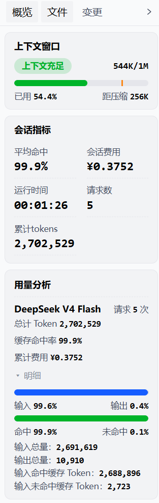
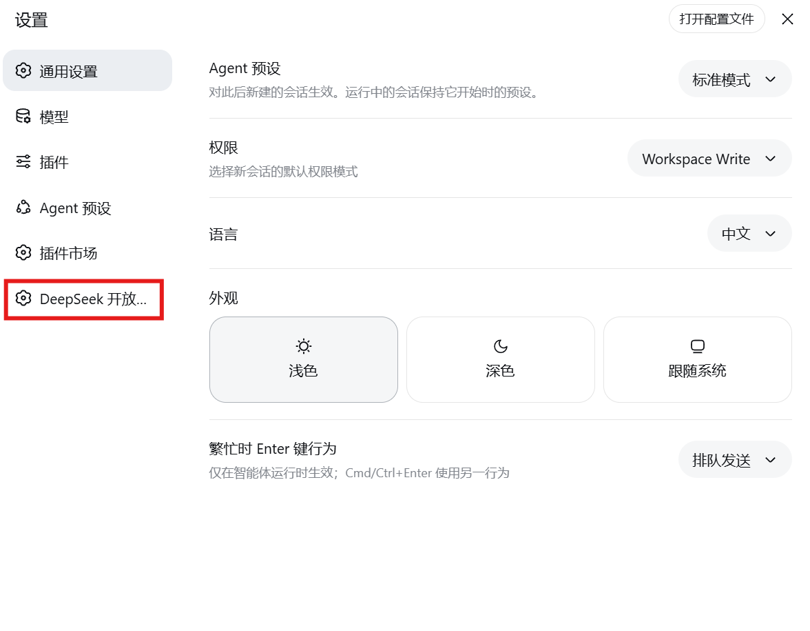

中文 | [English](README.en.md)

# dsh-dsov-plugin

为 DSH Web 网页端开发的轻量插件：在右侧侧边栏新增首位【概览】标签，实时统计当前会话运行时长与模型调用用量，并让设置面板中的【DeepSeek 开放平台】一键直达官方平台。

## ✨ 功能特性

- **侧边【概览】面板**：右侧侧边栏新增首位【概览】标签（固定顺序：概览 / 文件 / 变更），实时统计会话运行时长、API 请求次数与模型调用用量（Token、缓存命中率、费用等），数据每秒自动刷新，无需手动操作；
- **浅色 / 深色主题自适应**：全部界面跟随 DSH 系统主题自动切换浅色 / 深色模式，卡片、文字、进度条等配色自动适配，无需额外设置；
- **一键直达官方平台**：设置面板左侧新增【DeepSeek 开放平台】导航项，点击后直接唤起系统默认浏览器打开 https://platform.deepseek.com ，无需二次点击，无中间过渡页面。


<div align="center">

</div>

<br>

<div align="center">

</div>


## 📋 前置运行要求

- 已安装并可使用 [DeepSeek Harness](https://github.com/deepseek-ai/deepseek-harness)，`dsh` 命令行可用（全局安装或已加入 PATH）；
- Node.js 18 及以上（推荐 20+）；
- 目标 profile 为 `web`（本插件仅面向网页模式 `--profile web` 生效）。

## 📥 安装教程

### 方案 1：NPM 一键安装（普通终端用户）

```bash
# 发布到 npmjs 后（包名如 @你的用户名/dsh-dsov-plugin）：
dsh plugin --profile web add @你的用户名/dsh-dsov-plugin

# 重启 dsh web 使插件生效：
dsh --profile web
```

### 方案 2：源码本地编译部署（开发者 / 自定义修改人群）

```bash
# 1) 克隆仓库
git clone https://github.com/<你的用户名>/dsh-dsov-plugin.git
cd dsh-dsov-plugin

# 2) 安装依赖（零运行时依赖，仅需构建工具链）
npm install

# 3) 构建产物到 lib/
npm run build

# 4) 链接到本机 web profile（等价于 dsh plugin add link:<仓库绝对路径>）
npm run link:web

# 5) 重启 dsh web 使 bundle patch 生效
dsh --profile web
```

## 🚀 使用指南

1. 启动 `dsh --profile web` 并打开网页界面；
2. 点击右侧侧边栏的【概览】标签，查看当前会话的实时用量（会话运行时长、API 请求数、Token 消耗、缓存命中率、费用等）；
3. 打开设置面板，点击左侧【DeepSeek 开放平台】导航项，系统默认浏览器将直接打开官方平台 https://platform.deepseek.com。

## 🛠️ 本地开发构建指令

```bash
npm run build                                              # 构建 lib/（零依赖 Node 脚本）
npm run link                                               # 构建并链接到 profile web
npm run link:web                                           # 同上（显式指定 web）
node scripts/link-profile.mjs --unlink                     # 从 profile 卸载
node scripts/link-profile.mjs --profile tui                # 链接到其它 profile
```

工程结构：

```
dsh-dsov-plugin/
├── package.json          # 可发布 npm 包（dsh.bundle.patch / dsh.client 声明）
├── cordis.patch.yml      # profile bundle patch：插入插件行 ui-dsh-dsov
├── src/
│   ├── index.js          # Host 端：llm/stream 计量 + agent 活跃计时 + /dsov 路由
│   └── client.js         # Client 端：概览面板 + 设置导航直达（浏览器）
├── scripts/
│   ├── build.mjs         # 构建：src → lib（含 module-loader 包装）
│   └── link-profile.mjs  # 构建 + dsh plugin add link:（pnpm 策略拦截时自动降级手工 link）
├── lib/                  # 构建产物
├── README.md             # 本文档（简体中文）
├── README.en.md          # English
└── LICENSE               # MIT
```

## ⚠️ 常见问题

**Q：安装后页面没有出现【概览】标签 /【DeepSeek 开放平台】？**
A：请确认已重启 `dsh --profile web`（bundle patch 在启动时应用），并确认安装命令的 profile 为 `web`。

**Q：`dsh plugin add` 报 `ERR_PNPM_MINIMUM_RELEASE_AGE_VIOLATION`？**
A：这是 profile 的 pnpm 供应链策略（`minimumReleaseAge`）冻结 lockfile 导致，与插件无关。可等待违规条目超过策略时限，或将对应包加入 `minimumReleaseAgeExclude`，或在 profile 目录执行 `pnpm clean --lockfile && pnpm install` 重建锁文件。`link-profile.mjs` 检测到该策略时会自动降级为手工 link（junction），无需 pnpm 即可完成安装。

**Q：修改包名后插件无法加载？**
A：客户端 bundle 的模块 id 取自 `package.json` 的 `name`，改名后必须重新执行 `npm run build` 并重新 link。

**Q：会话用量数据为什么是空的 / 重启后清零？**
A：概览数据为当前会话的进程内实时统计，仅统计插件运行期间的模型调用；重启后从零累计属正常现象。

## 📄 开源许可证

本项目基于 [MIT License](LICENSE) 开源。
